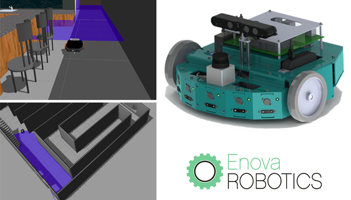

# Using Embedded sensors to detect and avoid obstacles using Mini-Lab and ROS.

This repository contains my working project on the [Mini-Lab rover](https://enovarobotics.eu/product/) from Enova Robotics

## Setup the workspace with ROS.

There is already a very nice tutorial page you can find here : https://wiki.ros.org/Mini-Lab/Tutorials/Workstation_installation to setup your workstation and use the robot with ROS packages.

## Objectives.

For this work, we had the 2-wheeled mobile robot Minilab which is equipped with two sensors :  a*** LIDAR sensor*** and a ***RGB-camera sensor***.
We controlled the robot using an ROS interface coding in Python with a pre-existed architecture and we are only using the LIDAR sensor for collecting data of the rover's position and angles.

**We had three main objectives to complete in this practical work  :**

* First one was to developing an algorithm for obstacles detection,when the robot is detecting an obstacle it should stop by itself.  
* Second one, to improve this algorithm to include obstacles avoidancei.e.the robot should continue to go forward while avoiding the detected obstacle.
* The final objective was to develop an algorithm based on the two last ones to allow the Minilab rover to track a target autonomously and follows it.  

## Results

The final programming can be found in these files : **[obstacle_avoidance_hokuyo.py]()** and **[tracking_target.py]()**

## About 

**This Pratical Work was led by Pr. Anis Sahbani.**

Anis Sahbani is an Associate Professor at Pierre & Marie Curie University (UPMC) now Sorbonne University. 
He is the graduate program coordinator of the Master degree in "Intelligent Systems & Robotics" at UPMC. 
He has an Electrical Engineer Degree (specialization on Industrial Data Processing) from École Nationale d'Ingénieurs de Tunis (E.N.I.T.) in 1998. MS in Automation and Computer engineering 1999. 
He received his PhD in Robotics and Computer Science from University of Paul Sabatier - Robotics and Artificial Intelligence Group of the LAAS-CNRS in 2003.

*The students will work on the Mini-Lab robot (more information here : https://enovarobotics.eu/product/),  its control architecture is open-source and is based on the Robot Operating System (ROS).
Firstly, they will need to understand the main code of ROS and how to connect the robot to the computer using its hardware.
Secondly, they will have to program an algorithm which will be use by the Mini-Lab to perform obstacle avoidance and target tracking.*